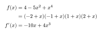
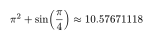
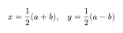
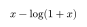

# Symbolica

The official [Symbolica](https://symbolica.io/) plugin for Typst, powered by
Symbolica 3.0. It is free to use for any use within Typst, including academic
and commercial work.

Available on [Typst Universe](https://typst.app/universe/package/symbolica/)
for use in the Typst web app and with the command-line compiler.

Symbolica lets you do symbolic computations and numerical evaluations directly in your Typst document. This avoids error-prone copy-pasting and keeps the displayed results in sync when you
change an equation or parameter.

You can currently:

- expand, factor, collect, differentiate, and inspect expressions;
- combine, cancel, or decompose rational functions;
- calculate derivatives and series;
- integrate expressions and see the integration steps;
- replace recurring patterns with wildcards;
- solve systems exactly or numerically;
- evaluate formulas over points or grids; and
- solve exact matrix problems.

Start with the [user manual](symbolica/manual.pdf), the
[minimal example](symbolica/examples/basic.typ), or the
[polynomial-system showcase](symbolica/examples/showcase.typ). The manual contains
the conceptual guide, task-oriented examples, limitations, and complete API
reference.

## Quick start

### Exact factorization and differentiation

Import Symbolica and calculate directly in a Typst document:

<!-- readme-example: factorization -->
```typst
#import "@preview/symbolica:0.1.0": *

#let x = literal("x")
#let f = parse($x^4 - 5 x^2 + 4$)

$
  f(x) &= #to-typst(f) \
       &= #to-typst(factor(f)) \
  f'(x) &= #to-typst(derivative(f, x))
$
```



The factorization and derivative are computed exactly while Typst compiles the document.
Symbolica expressions are opaque values; render them with `to-typst` or inspect
them with `canonical`.

The public names work with wildcard imports while leaving Typst's native
`math`, `symbol`, `function`, `content`, and math layout functions available.

### Parse Typst formulas or strings

`parse` accepts both Typst math content and strings in Symbolica syntax:

```typst
#import "@preview/symbolica:0.1.0": *

#let from-math = parse($x^2 / (1 + x)$)
#let from-string = parse("x^2/(1+x)")
#assert.eq(canonical(from-math), canonical(from-string))

#let expression = parse("2*x + y", namespace: "model")
#let x = literal("x", namespace: "model")
$ #to-typst(derivative(expression, x)) $
```

Strings use Symbolica's expression syntax, including explicit `*` for
multiplication. Typst formulas use Parsely and retain their decorated notation.
`parse` also accepts numbers and existing expressions: integers remain exact,
floats retain their value, and existing Atom bytes pass through unchanged.
Use `literal("x")` to construct a symbol explicitly. In algebra function
arguments, strings still represent single leaves; parse a string first when
it contains a whole expression.

### Use a formula as one literal symbol

`literal` accepts a symbol name or supported Typst content. Content supplies the
label for one opaque symbol: `literal($x+1$)` does not become an algebraic sum.
Composite labels are grouped when rendered by either `to-typst` or
`to-typst-source`.

```typst
#import "@preview/symbolica:0.1.0": *

#let label = literal($x + 1$)
$ #to-typst(pow(label, 2)) $

#let first = literal($a_0$, name: "first_coefficient", namespace: "model")
#let second = literal($a_0$, name: "second_coefficient", namespace: "model")
#assert.ne(canonical(first, namespaces: true), canonical(second, namespaces: true))
```

Without `name`, repeated labels have stable identities within their namespace.
Simple `literal($x$)` agrees with `literal("x")`, and `literal($a_0$)` agrees
with `parse($a_0$)`. The optional `name` applies only to content and lets two
symbols share a label while retaining distinct identities. `namespace` and
`tags` work with both input forms. Names must not end with an underscore.

Labels support portable math structures and text. Unsupported styling,
context-dependent content, and layout elements are rejected; use `notation`
for custom presentation around an explicitly named symbol. Plain source output
preserves the label's appearance, while `to-typst` also carries its exact identity.

Use `wild("a")` for a pattern placeholder. Its base name must be nonempty and
must not end with an underscore; `level` is a positive integer. `wild` returns
an Atom payload for matching, and `level: 0` is rejected.

### Numerical evaluation with π

Evaluate `π² + sin(π/4)` using Symbolica's built-in value of π:

<!-- readme-example: evaluation -->
```typst
#import "@preview/symbolica:0.1.0": *

#let expression = parse($pi^2 + sin(pi / 4)$)
#let value = evaluate(expression)

$ pi^2 + sin(pi / 4) approx #calc.round(value.re, digits: 8) $
```



`evaluate` returns a dictionary
with real and imaginary parts, `re` and `im`; here `im` is zero.

### Solve a system with parameters

Solve `x + y = a` and `x - y = b` for `x` and `y`, keeping `a` and `b` symbolic:

<!-- readme-example: solve -->
```typst
#import "@preview/symbolica:0.1.0": *

#let solutions = solve(
  ($x + y - a$, $x - y - b$).map(parse),
  ($x$, $y$).map(parse),
  domain: "real",
)

#let (x, y) = solutions.branches.first().values.map(to-typst)
$ x = #x, quad y = #y $
```



### Symbolic integration

<!-- readme-example: integration -->
```typst
#import "@preview/symbolica:0.1.0": *

#let x = parse($x$)
#let f = parse($x / (x + 1)$)
#to-typst(integrate(f, x))
```



The first call to `integrate` or `integrate-with-steps` compiles and initializes
the integration rule sets, which may take about 10 seconds. Both functions share
the cached rules, so later calls and ordinary edits reuse them.

## Symbolic payloads

The `symbolica-typst-plugin` Rust crate provides both the Typst plugin and a
reusable library for other plugins, including tydenso. Its public `payload`,
`math_display`, and `typst_ast` modules combine Symbolica's exact native Atom
export with schema-keyed portable attachments, notation, parsing, and a render
tree.

`parse` preserves subscripts and corner attachments as decorated symbols.
For example, `$a_0-a_1$` keeps two distinct variables, `$C_(i j)$` retains the
order of its labels, and `$h'(c)$` is a call with a decorated function head.
All six Typst attachment positions (`t`, `b`, `tl`, `tr`, `bl`, `br`) are
supported, including nested labels and primes. In ordinary expressions, `t`
keeps its algebraic meaning: `$a_i^2$` is the square of `$a_i$`.

Decorations are literal notation: primes do not request differentiation, and
substitution does not traverse labels stored in symbol data. Use `derivative`
for differentiation and function arguments for indices that participate in
algebra. Rendered content retains exact Atom metadata; plain Typst source
preserves notation but does not carry namespaces or other hidden metadata.

The shared `math_display::MathDisplay` type stores the ordered display tree in
versioned Symbolica symbol data and exports a `symbolica.math-display`
attachment for other renderers. Its deterministic symbol names distinguish
labels without depending on a runtime's symbol IDs.

Several Typst packages are in development that make use of the symbolic payload, for example
the tensor algebra package [spenso](https://github.com/alphal00p/gammaloop).

## Use in the Typst web app

Import the published package from [Typst Universe](https://typst.app/universe/package/symbolica/):

```typst
#import "@preview/symbolica:0.1.0": *
```

Typst fetches the package automatically. No manual Wasm upload, file splitting,
or loader changes are needed. The optimized runtime archive is just under **8 MB compressed**.

## Logo

Use `logo()` to place the Symbolica logo inline. It follows the text size by
default; use `size` to set its width and height.

```typst
#import "@preview/symbolica:0.1.0": logo

Calculated with #logo() Symbolica.

#logo(size: 2em)
```

## Documentation and examples

- [User manual](symbolica/manual.pdf) — quickstart, concepts, recipes, symbolic
  integration with nested Rubi steps, limitations, and complete API reference
- [Minimal example](symbolica/examples/basic.typ) — a compact first document
- [Rubi integration](symbolica/examples/integration.typ) — an antiderivative and
  its nested rule steps
- [Polynomial-system showcase](symbolica/examples/showcase.typ) — exact solving,
  factorization, substitution, and a Jacobian determinant in one case study
- [Batched expression grid](symbolica/examples/expression-grid.typ) — evaluate four
  formulas together over a two-dimensional parameter grid
- [Lotka–Volterra trajectory](symbolica/examples/lotka-volterra.typ) — evaluate
  both right-hand sides together inside a local Runge–Kutta loop
- [Complex phase portrait](symbolica/examples/phase-portrait.typ) — evaluate a
  rational function over thousands of complex points in one batch
- [Changelog](CHANGELOG.md) — user-visible changes and compatibility notes

## Attribution and licensing

The official `symbolica` Typst plugin is
free to use for any use within Typst, including academic and commercial work.
No Symbolica license or license key is needed for use within Typst.

The [Symbolica Typst permission](LICENSE-SYMBOLICA-TYPST.md) explicitly grants
free runtime use for all purposes within Typst, including commercial, server,
and hosted use. No payment, registration, activation, license key, or separate
runtime agreement is required. It also permits redistribution of the plugin
and rebuilding unmodified Symbolica as part of it. It grants no additional
rights to modify Symbolica itself or distribute modified Symbolica source.

The original Typst interface and Rust adapter code are under [MIT](LICENSE).
The `license = "MIT"` field in `typst.toml` describes that original plugin code.

**The bundled `symbolica/symbolica.wasm` is built from components under multiple
licenses and is not covered solely by MIT.** Symbolica's components are covered
by its [source-available license](LICENSE-SYMBOLICA.md), with the
[Symbolica Typst permission](LICENSE-SYMBOLICA-TYPST.md) taking precedence for
the uses it grants. Use outside Typst retains the otherwise applicable
Symbolica terms. Other dependencies retain their respective licenses,
including LGPL and MPL terms where applicable.

See the [third-party notices](THIRD_PARTY.md),
[complete dependency license texts](THIRD_PARTY_LICENSES.txt), and
[source locations and rebuilding instructions](REBUILDING.md). The MIT
declaration does not relicense any bundled dependency.

Thanks also to [Parsely](https://typst.app/universe/package/parsely/) for making
native Typst-math parsing possible, and to
[Tidy](https://typst.app/universe/package/tidy/) for the documentation tools.
The batched-evaluation, predator–prey, and phase-portrait examples were inspired
by TimeTravelPenguin's
[`symbolic-eval`](https://github.com/TimeTravelPenguin/symbolic-eval) package and
independently adapted to Symbolica's API. Their pinned sources and upstream
license declaration are recorded in the [third-party notices](THIRD_PARTY.md).
